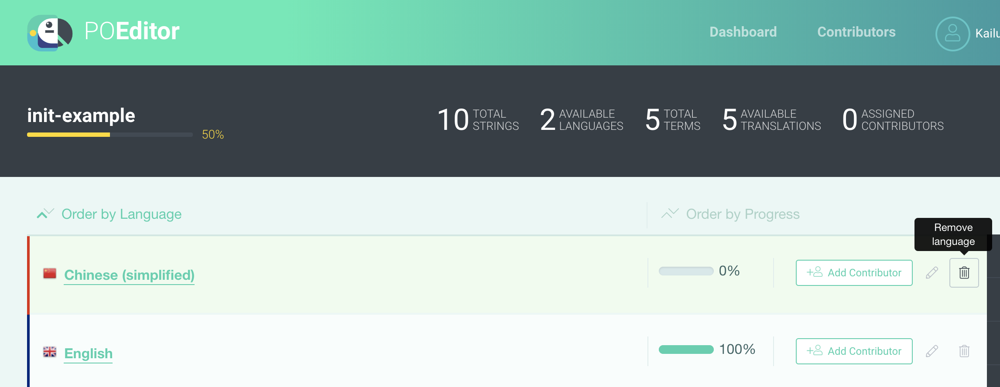
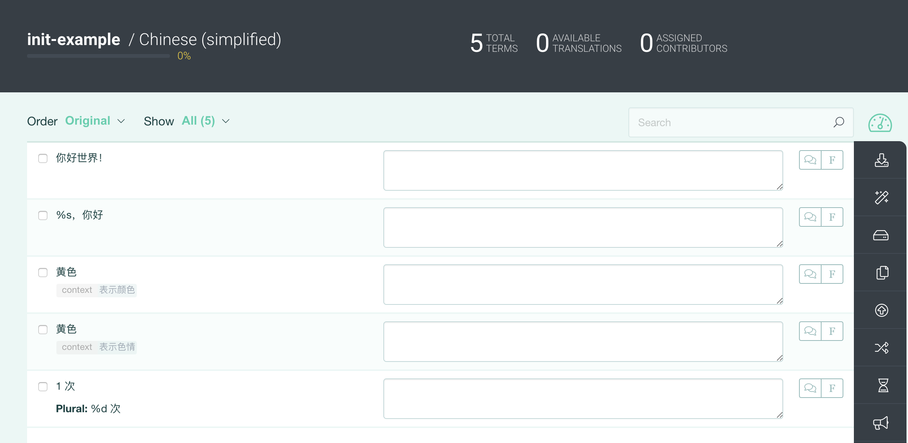
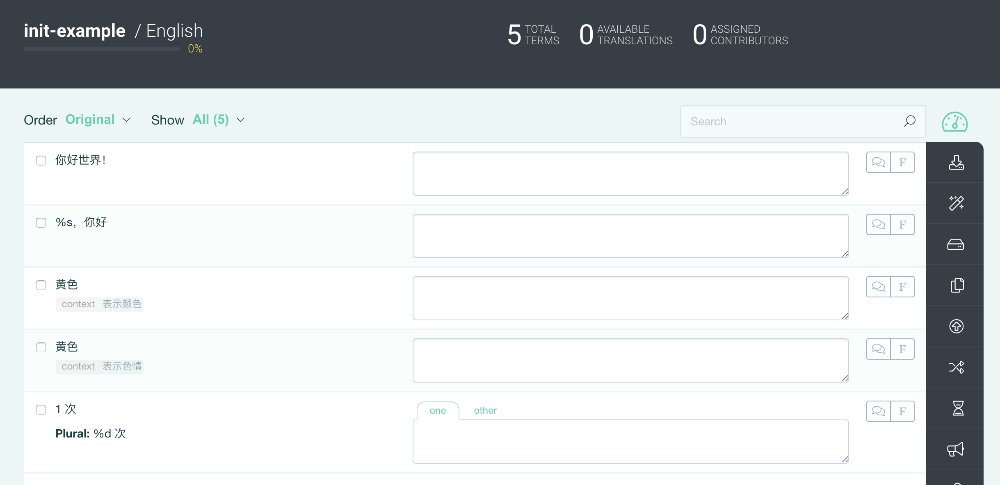
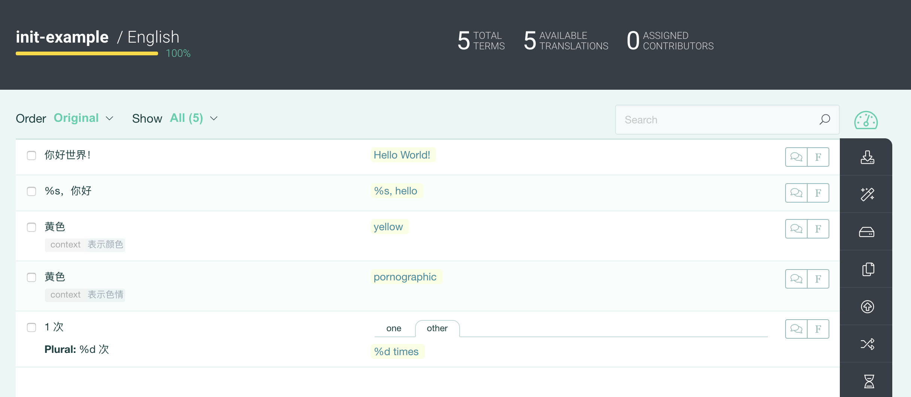

# i18n-example

该项目演示如何结合 node-gettext、narp 和 poeditor 提供一套相对完整的国际化方案

相关文章：[前端国际化方案选择](https://www.jianshu.com/p/47dab3691d70)

## 运行该项目

1. 执行 yarn install 安装依赖，然后执行 yarn start 即可看到界面
2. 如果想要修改翻译文本，需要修改 .narprc 中的配置，以指向到你的项目，同时执行 yarn narp-push 命令上传翻译文件，
   在 poeditor 上完成翻译后，再执行 yarn narp-pull 获取翻译后的数据。如需了解更多，请阅读后面的详细介绍。

## 工具库介绍

### node-gettext

[node-gettext](https://github.com/alexanderwallin/node-gettex) 是 [GNU gettext](https://www.gnu.org/software/gettext/)  javascript 版本的实现，相对于 GNU gettext 提供字符串、数字、时间的处理，node-gettext 只提供了字符串（包括复数）的处理，原因是已经有大量优秀的第三方库提供了这类处理，例如 [moment](https://github.com/moment/moment) 提供了对时间的处理。

node-gettext 的使用示例：

```
const gt = new Gettext()

// 普通文本
gt.gettext('Some text')

// 复数
gt.ngettext('One thing', 'Many things', numberOfThings)

// 带上下文
gt.pgettext('sports', 'Back')
```

node-gettext 不支持插值替换，不过你可以结合 sprintf-js 这样的第三方库来做进一步的封装，如下：

```
  function myGettext(msgid, values=[]) {
    let str = gt.gettext(msgid)
    return values.length ? vsprintf(str, values) : str
  }

  myGettext('%s, 你好', ['kailunyao'])
```


### poeditor

[poeditor](https://poeditor.com/) 是一个在线的本地化管理平台，提供翻译和翻译资源管理等功能


### narp

[narp](https://github.com/laget-se/narp) 是 node-gettext 和 poeditor 之间的桥梁，它提供自动提取翻译文本、上传翻译文件到 poeditor 和从 poeditor 拉取翻译后的文件等功能。使用简单，仅需要在项目下新建 .narprc 文件进行相关配置，使用 narp 的 push 和 pull 命令进行操作即可，配置示例如下：

```
{
  "vendor": {
    "name": "poeditor",
    "credentials": {
      "token": ""
    },
    "options": {
      "project": "224333",
      "sourceLanguage": "zh-CN"
    }
  },
  "extract": {
    "source": "./src/**/*.js",
    "funcArgumentsMap": {
      "_": ["msgid"],
      "_p": ["msgid", "msgid_plural"],
      "_c": ["msgctxt","msgid"],
      "_cp": ["msgctxt","msgid", "msgid_plural"]
    }
  },
  "output": "./src/translations/locales.json",
  "verbose": true
}
```

不过，narp 会将所有的翻译文件都合并到一个 json 文件中，因此不适合做按需加载。


## 整体流程介绍

1.对 node-gettext 做一层简单的封装

node-gettext 提供的功能并不适合所有开发团队，所以有必要结合自己项目的要求做下封装，如：

a. 进行初始化操作，并确保该操作是单例的

b. 函数重命名。由于我们会到处用到翻译函数，因此确保翻译函数名简短且不冲突，显得很有必要

c. 对插值功能提供支持

2.使用 node-gettext 函数包装文本

3.注册 poeditor 账号，创建项目，在项目中创建所需要的语言，示例如下：



在项目根目录下创建 .narprc 文件，并根据项目的信息和开发需求进行配置

3.执行 narp push (具体命令可在 package.json 中配置)，提取翻译文本，并推送到 poeditor，同时生成包含翻译文本的 json 文件，供 node-gettext 使用





4.在 poeditor 上进行翻译，然后执行 narp pull 拉取最新翻译后的文件


